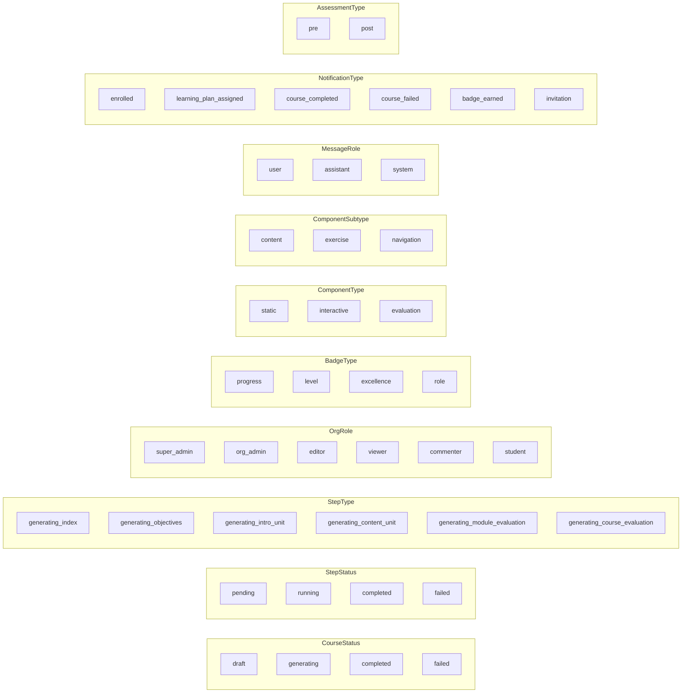

# Database Entity-Relationship Diagram

> Auto-generated from the Prisma schema at `apps/api/prisma/schema.prisma`.

This document describes the complete data model for **acadion.ai**, organized into logical domains: authentication, course creation, LMS/enrollment, organizations, learning plans, badges, portfolio, and notifications.

---

## Full ER Diagram

```mermaid
erDiagram
    %% ── Authentication & Users ──
    User {
        uuid id PK
        string name
        string email UK
        datetime emailVerified
        string image
        string password
        string username UK
        datetime createdAt
        datetime updatedAt
    }

    Account {
        uuid id PK
        uuid userId FK
        string type
        string provider
        string providerAccountId
        string refresh_token
        string access_token
        int expires_at
        string token_type
        string scope
        string id_token
        string session_state
        datetime createdAt
        datetime updatedAt
    }

    Session {
        uuid id PK
        string sessionToken UK
        uuid userId FK
        datetime expires
        datetime createdAt
        datetime updatedAt
    }

    VerificationToken {
        string identifier
        string token
        datetime expires
    }

    User ||--o{ Account : "has"
    User ||--o{ Session : "has"

    %% ── Organizations ──
    Organization {
        int id PK
        uuid key UK
        string name
        string slug UK
        string logo
        datetime createdAt
        datetime updatedAt
    }

    UserOrganization {
        uuid userId PK
        int orgId PK
        enum role
        datetime createdAt
        datetime updatedAt
    }

    Group {
        int id PK
        uuid key UK
        int orgId FK
        string name
        string description
        datetime createdAt
        datetime updatedAt
    }

    UserGroup {
        uuid userId PK
        int groupId PK
        datetime createdAt
    }

    User ||--o{ UserOrganization : "belongs to"
    Organization ||--o{ UserOrganization : "has members"
    Organization ||--o{ Group : "contains"
    User ||--o{ UserGroup : "member of"
    Group ||--o{ UserGroup : "has members"

    %% ── Courses ──
    Course {
        int id PK
        uuid key UK
        string title
        int orgId FK
        uuid userId FK
        json input
        json output
        enum status
        int estimatedMinutes
        boolean isAdaptive
        datetime createdAt
        datetime updatedAt
        datetime completedAt
    }

    CourseStep {
        int id PK
        int courseId FK
        enum status
        json payload
        json error
        enum type
        int completionTokens
        int promptTokens
        datetime createdAt
        datetime updatedAt
    }

    Component {
        int id PK
        uuid key UK
        string name
        string description
        json properties
        string internalName
        enum type
        enum subtype
        int version
        datetime createdAt
        datetime updatedAt
    }

    CourseComponent {
        int id PK
        int courseId FK
        int componentId FK
        uuid userId FK
        int module
        int unit
        int sequence
        json data
        datetime createdAt
        datetime updatedAt
    }

    User ||--o{ Course : "creates"
    Organization ||--o{ Course : "owns"
    Course ||--o{ CourseStep : "has steps"
    Course ||--o{ CourseComponent : "composed of"
    Component ||--o{ CourseComponent : "used in"
    User ||--o{ CourseComponent : "authored"

    %% ── Conversations ──
    Conversation {
        uuid id PK
        uuid userId FK
        string title
        boolean isArchived
        int courseId FK
        datetime createdAt
        datetime updatedAt
    }

    Message {
        uuid id PK
        uuid conversationId FK
        enum role
        string content
        int sequence
        string modelName
        int tokensUsed
        json metadata
        datetime createdAt
    }

    User ||--o{ Conversation : "owns"
    Course ||--o{ Conversation : "discussed in"
    Conversation ||--o{ Message : "contains"

    %% ── LMS & Enrollment ──
    Enrollment {
        int id PK
        uuid userId FK
        int courseId FK
        datetime enrolledAt
        datetime startedAt
        datetime completedAt
        boolean passed
        float score
        int attempts
    }

    CourseUnitProgress {
        int id PK
        int enrollmentId FK
        string unitCode
        datetime completedAt
        int timeSpentSeconds
        int focusLossCount
    }

    KnowledgeCheckAttempt {
        int id PK
        int enrollmentId FK
        string unitCode
        int questionIndex
        json answer
        boolean isCorrect
        int attemptNumber
        datetime createdAt
    }

    AdaptiveAssessment {
        int id PK
        int enrollmentId FK
        enum type
        string unitCode
        int confidenceScore
        datetime createdAt
    }

    User ||--o{ Enrollment : "enrolled in"
    Course ||--o{ Enrollment : "has enrollments"
    Enrollment ||--o{ CourseUnitProgress : "tracks"
    Enrollment ||--o{ KnowledgeCheckAttempt : "attempts"
    Enrollment ||--o{ AdaptiveAssessment : "assessed by"

    %% ── Learning Plans ──
    LearningPlan {
        int id PK
        uuid key UK
        int orgId FK
        string name
        string description
        string image
        string badgeImage
        string badgeName
        int estimatedDays
        boolean isCorrelative
        boolean isOptional
        int parentId FK
        datetime createdAt
        datetime updatedAt
    }

    LearningPlanCourse {
        int learningPlanId PK
        int courseId PK
        int order
        boolean required
    }

    UserLearningPlan {
        int id PK
        uuid userId FK
        int learningPlanId FK
        datetime enrolledAt
        datetime deadline
        datetime completedAt
    }

    Organization ||--o{ LearningPlan : "offers"
    LearningPlan ||--o{ LearningPlan : "parent/child"
    LearningPlan ||--o{ LearningPlanCourse : "includes"
    Course ||--o{ LearningPlanCourse : "part of"
    User ||--o{ UserLearningPlan : "assigned to"
    LearningPlan ||--o{ UserLearningPlan : "assigned"

    %% ── Badges ──
    Badge {
        int id PK
        uuid key UK
        int orgId FK
        string name
        string description
        string image
        enum type
        string conditionType
        json conditionValue
        int targetId
        boolean isPublic
        boolean isActive
        datetime createdAt
    }

    UserBadge {
        int id PK
        uuid userId FK
        int badgeId FK
        datetime earnedAt
    }

    Organization ||--o{ Badge : "defines"
    Badge ||--o{ UserBadge : "awarded as"
    User ||--o{ UserBadge : "earns"

    %% ── Portfolio ──
    Portfolio {
        int id PK
        uuid userId FK
        string title
        string bio
        string tagline
        string portraitImage
        string coverImage
        string email
        string phone
        string theme
        stringArray skills
        stringArray languages
        string socialLinkedin
        string socialTwitter
        string socialInstagram
        json socialCustom
        boolean isPublic
        datetime createdAt
        datetime updatedAt
    }

    PortfolioImage {
        int id PK
        int portfolioId FK
        string url
        string description
        int order
        datetime createdAt
    }

    PortfolioVideo {
        int id PK
        int portfolioId FK
        string url
        string description
        int order
        datetime createdAt
    }

    PortfolioVisit {
        int id PK
        int portfolioId FK
        string country
        int courseId
        datetime createdAt
    }

    PortfolioContactMessage {
        int id PK
        int portfolioId FK
        string senderName
        string senderEmail
        string message
        datetime createdAt
    }

    PortfolioCourse {
        int portfolioId PK
        int courseId PK
        int order
    }

    User ||--o| Portfolio : "has"
    Portfolio ||--o{ PortfolioImage : "contains"
    Portfolio ||--o{ PortfolioVideo : "contains"
    Portfolio ||--o{ PortfolioVisit : "tracked by"
    Portfolio ||--o{ PortfolioContactMessage : "receives"
    Portfolio ||--o{ PortfolioCourse : "showcases"
    Course ||--o{ PortfolioCourse : "showcased in"

    %% ── Notifications ──
    Notification {
        int id PK
        uuid userId FK
        enum type
        json data
        datetime readAt
        datetime createdAt
    }

    User ||--o{ Notification : "receives"
```

---

## Enumerations

---

## Domain Summary

| Domain | Tables | Purpose |
|---|---|---|
| Auth & Users | `User`, `Account`, `Session`, `VerificationToken` | Authentication, OAuth, sessions |
| Organizations | `Organization`, `UserOrganization`, `Group`, `UserGroup` | Multi-tenant org structure with groups |
| Courses | `Course`, `CourseStep`, `Component`, `CourseComponent` | AI-generated course content |
| Conversations | `Conversation`, `Message` | AI chat during course creation |
| LMS | `Enrollment`, `CourseUnitProgress`, `KnowledgeCheckAttempt`, `AdaptiveAssessment` | Student progress and adaptive learning |
| Learning Plans | `LearningPlan`, `LearningPlanCourse`, `UserLearningPlan` | Structured learning paths |
| Badges | `Badge`, `UserBadge` | Gamification and achievements |
| Portfolio | `Portfolio`, `PortfolioImage`, `PortfolioVideo`, `PortfolioVisit`, `PortfolioContactMessage`, `PortfolioCourse` | Public user portfolio |
| Notifications | `Notification` | In-app notification system |
