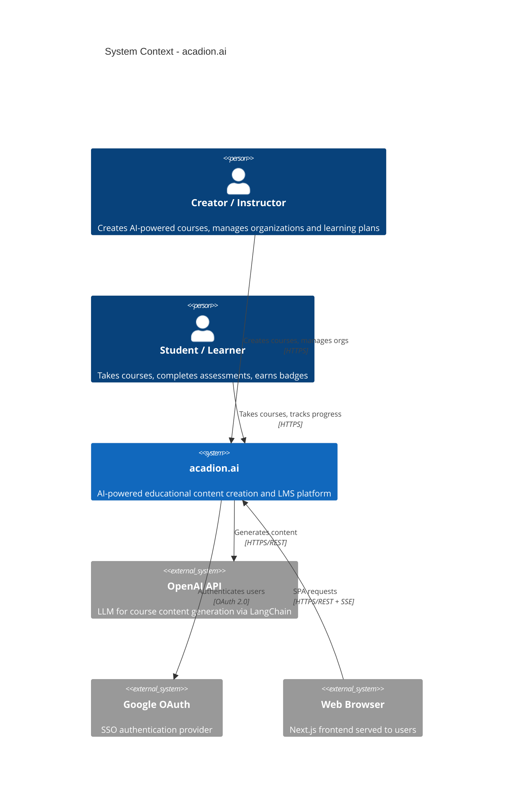
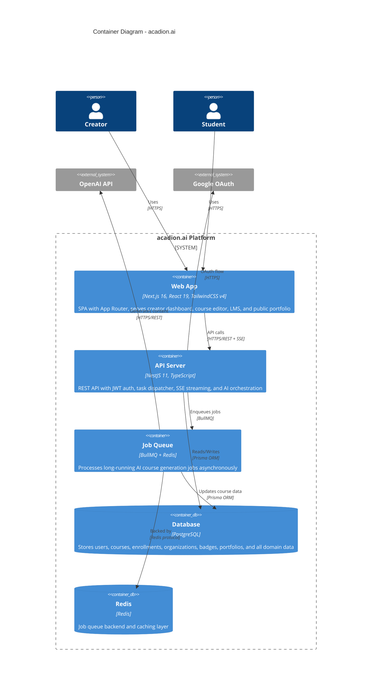
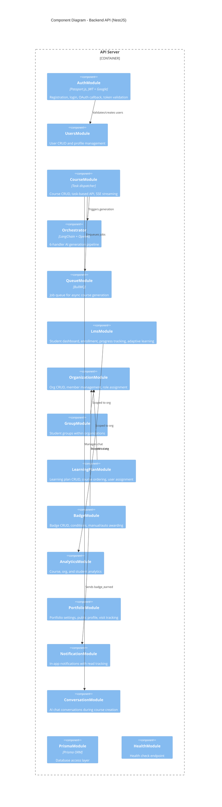
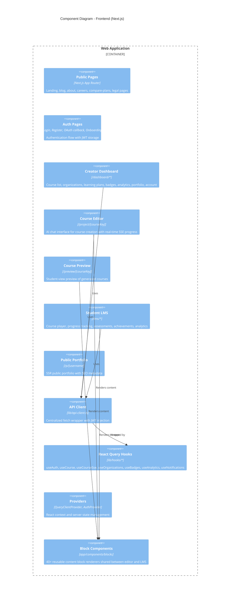
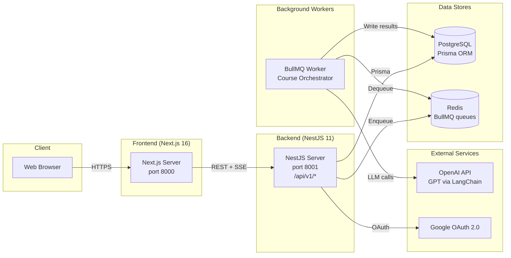

# C4 Architecture Diagrams

> System architecture for **acadion.ai** presented using the C4 model (Context, Container, Component).

---

## Level 1 -- System Context

Shows acadion.ai and its external dependencies from the highest level.

---

## Level 2 -- Container Diagram

Shows the major deployable units and their interactions.

---

## Level 3 -- Component Diagram (Backend)

Shows the NestJS modules that make up the backend API server.

---

## Level 3 -- Component Diagram (Frontend)

Shows the major areas of the Next.js frontend application.

---

## Infrastructure Overview

---

## Key Architectural Decisions

| Decision | Choice | Rationale |
|---|---|---|
| Frontend framework | Next.js 16 with App Router | SSR for public pages (portfolio, SEO), SPA for dashboard |
| Backend framework | NestJS 11 | Modular architecture, TypeScript-native, decorator-based |
| Database ORM | Prisma | Type-safe queries, schema-as-code, easy migrations |
| Job queue | BullMQ + Redis | Reliable async processing for long AI generation jobs |
| AI integration | LangChain + OpenAI | Structured output with Zod schemas, composable chains |
| Real-time updates | SSE (Server-Sent Events) | Simpler than WebSockets for unidirectional progress streaming |
| Authentication | JWT + Google OAuth | Stateless auth with optional SSO |
| State management | React Query | Server-state caching, background refetching, optimistic updates |
| Styling | Tailwind CSS v4 | Utility-first, rapid UI development |
