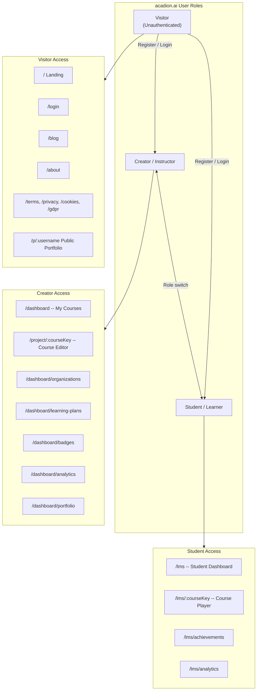
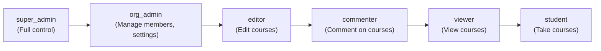
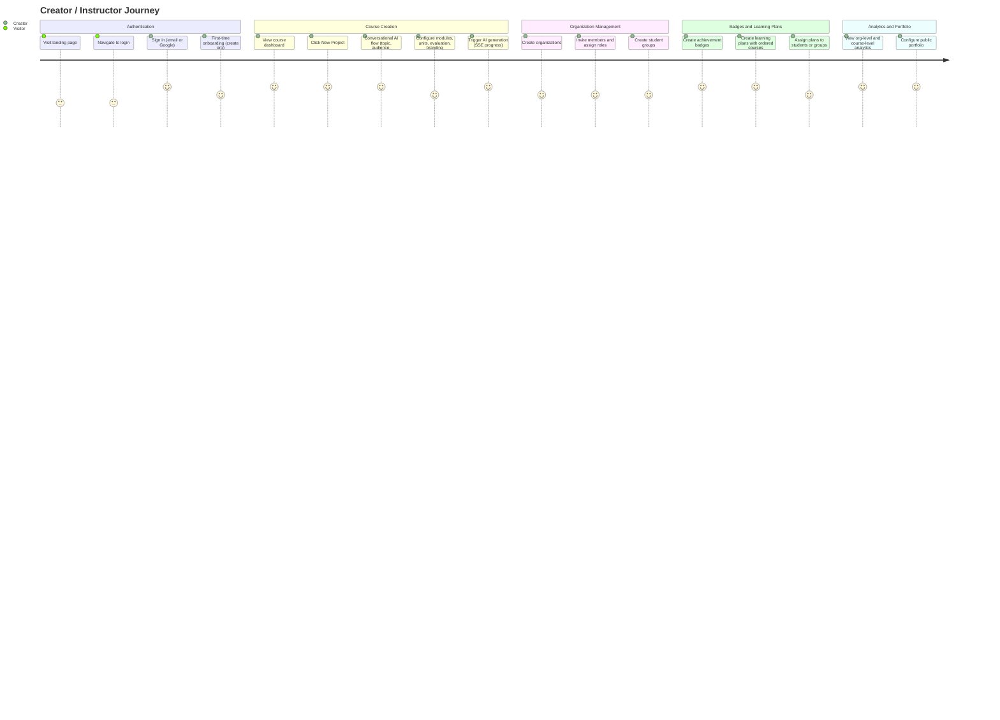
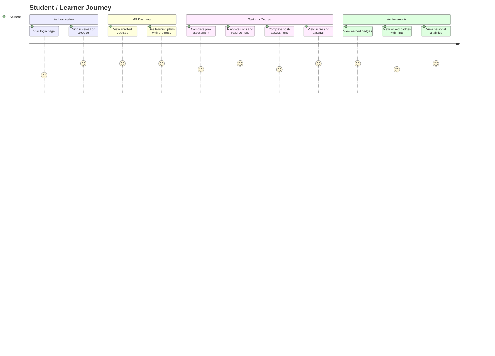

# User Journeys

> Documents the user roles, journeys, and navigation flows for **acadion.ai**.

The platform serves two primary user roles -- **Creator/Instructor** and **Student/Learner** -- each with distinct dashboards and workflows. This document provides an overview and links to detailed diagrams.

---

## Detailed Diagrams

Each sub-diagram is maintained in its own file for readability:

| File | Description |
|---|---|
| [03a-user-roles.md](./03a-user-roles.md) | Route map organized by user role (Visitor, Creator, Student) |
| [03b-creator-journey.md](./03b-creator-journey.md) | Mermaid journey chart for the Creator/Instructor experience |
| [03c-creator-flow.md](./03c-creator-flow.md) | Detailed flowchart of the Creator workflow and navigation |
| [03d-student-journey.md](./03d-student-journey.md) | Mermaid journey chart for the Student/Learner experience |
| [03e-student-flow.md](./03e-student-flow.md) | Detailed flowchart of the Student workflow and navigation |
| [03f-auth-flow.md](./03f-auth-flow.md) | Authentication flowchart (login, register, OAuth, token lifecycle) |
| [03g-navigation-map.md](./03g-navigation-map.md) | Complete navigation map across all application areas |

---

## User Roles Overview

---

## Organization Roles

Within an organization, users are assigned one of the following roles (cumulative permissions):

---

## High-Level Creator Journey

---

## High-Level Student Journey

