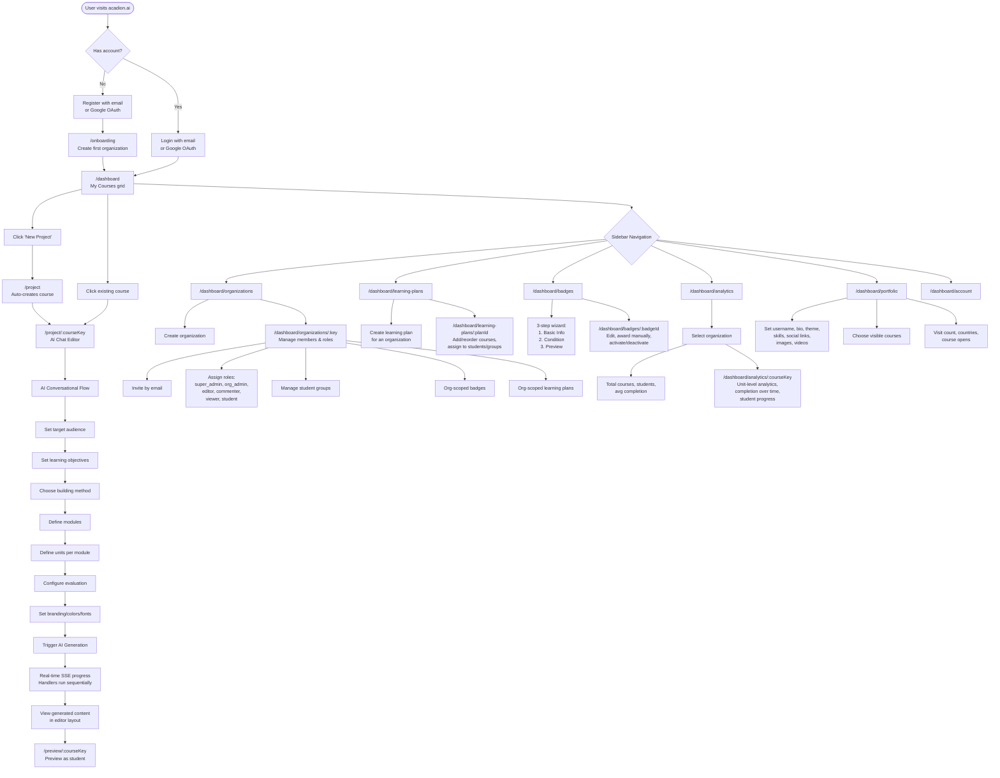

```mermaid
flowchart TD
    Start([User visits acadion.ai]) --> HasAccount{Has account?}
    HasAccount -->|No| Register[Register with email\nor Google OAuth]
    HasAccount -->|Yes| Login[Login with email\nor Google OAuth]
    Register --> Onboarding["/onboarding\nCreate first organization"]
    Onboarding --> Dashboard

    Login --> Dashboard["/dashboard\nMy Courses grid"]

    Dashboard --> NewProject[Click 'New Project']
    Dashboard --> ExistingCourse[Click existing course]
    Dashboard --> SidebarNav{Sidebar Navigation}

    NewProject --> CreateCourse["/project\nAuto-creates course"]
    CreateCourse --> Editor["/project/:courseKey\nAI Chat Editor"]

    ExistingCourse --> Editor

    Editor --> ChatFlow[AI Conversational Flow]
    ChatFlow --> SetAudience[Set target audience]
    SetAudience --> SetObjective[Set learning objectives]
    SetObjective --> SetBuildMethod[Choose building method]
    SetBuildMethod --> SetModules[Define modules]
    SetModules --> SetUnits[Define units per module]
    SetUnits --> SetEvaluation[Configure evaluation]
    SetEvaluation --> SetBranding[Set branding/colors/fonts]
    SetBranding --> Generate[Trigger AI Generation]
    Generate --> SSE[Real-time SSE progress\nHandlers run sequentially]
    SSE --> EditorView[View generated content\nin editor layout]
    EditorView --> PreviewCourse["/preview/:courseKey\nPreview as student"]

    SidebarNav --> Orgs["/dashboard/organizations"]
    SidebarNav --> Plans["/dashboard/learning-plans"]
    SidebarNav --> BadgesPage["/dashboard/badges"]
    SidebarNav --> AnalyticsPage["/dashboard/analytics"]
    SidebarNav --> PortfolioPage["/dashboard/portfolio"]
    SidebarNav --> AccountPage["/dashboard/account"]

    Orgs --> CreateOrg[Create organization]
    Orgs --> ManageOrg["/dashboard/organizations/:key\nManage members & roles"]
    ManageOrg --> InviteMembers[Invite by email]
    ManageOrg --> AssignRoles[Assign roles:\nsuper_admin, org_admin,\neditor, commenter,\nviewer, student]
    ManageOrg --> OrgGroups[Manage student groups]
    ManageOrg --> OrgBadgesPage[Org-scoped badges]
    ManageOrg --> OrgPlansPage[Org-scoped learning plans]

    Plans --> CreatePlan[Create learning plan\nfor an organization]
    Plans --> PlanDetail["/dashboard/learning-plans/:planId\nAdd/reorder courses,\nassign to students/groups"]

    BadgesPage --> CreateBadge[3-step wizard:\n1. Basic Info\n2. Condition\n3. Preview]
    BadgesPage --> BadgeDetailPage["/dashboard/badges/:badgeId\nEdit, award manually,\nactivate/deactivate"]

    AnalyticsPage --> SelectOrg[Select organization]
    SelectOrg --> ViewOrgMetrics[Total courses, students,\navg completion]
    SelectOrg --> DrillCourse["/dashboard/analytics/:courseKey\nUnit-level analytics,\ncompletion over time,\nstudent progress"]

    PortfolioPage --> ConfigurePortfolio[Set username, bio, theme,\nskills, social links,\nimages, videos]
    PortfolioPage --> SelectCourses[Choose visible courses]
    PortfolioPage --> ViewPortfolioAnalytics[Visit count, countries,\ncourse opens]
```