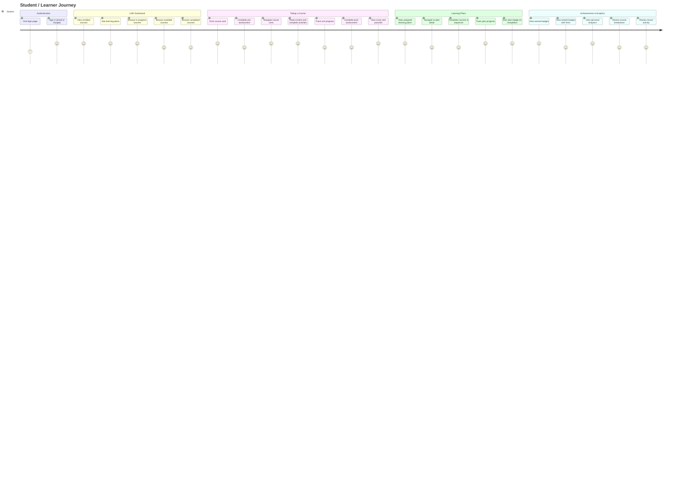

```mermaid
journey
    title Student / Learner Journey
    section Authentication
      Visit login page: 3: Student
      Sign in (email or Google): 5: Student
    section LMS Dashboard
      View enrolled courses: 5: Student
      See learning plans: 5: Student
      Browse in-progress courses: 5: Student
      Browse available courses: 4: Student
      Browse completed courses: 4: Student
    section Taking a Course
      Click course card: 5: Student
      Complete pre-assessment: 4: Student
      Navigate course units: 5: Student
      Read content and complete activities: 5: Student
      Track unit progress: 4: Student
      Complete post-assessment: 4: Student
      View score and pass/fail: 5: Student
    section Learning Plans
      View assigned learning plans: 5: Student
      Navigate to plan detail: 4: Student
      Complete courses in sequence: 4: Student
      Track plan progress: 5: Student
      Earn plan badge on completion: 5: Student
    section Achievements & Analytics
      View earned badges: 5: Student
      View locked badges with hints: 4: Student
      View personal analytics: 5: Student
      Review course breakdown: 4: Student
      Review recent activity: 4: Student
```