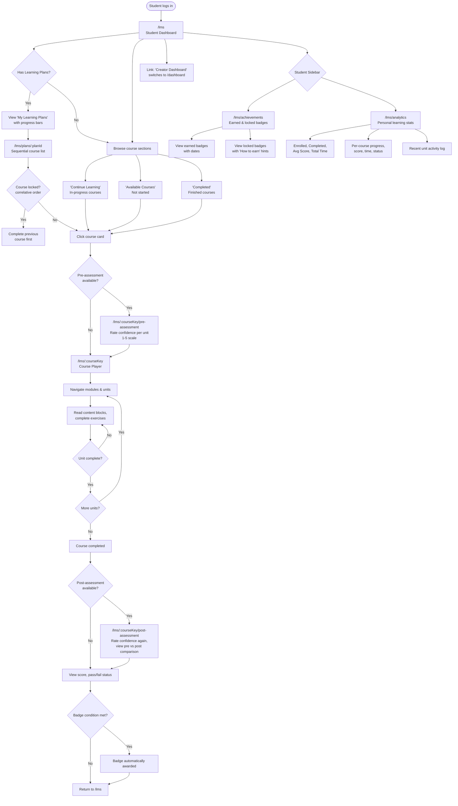

```mermaid
flowchart TD
    Start([Student logs in]) --> LMS["/lms\nStudent Dashboard"]

    LMS --> PlanSection{Has Learning Plans?}
    PlanSection -->|Yes| ViewPlans[View 'My Learning Plans'\nwith progress bars]
    ViewPlans --> PlanDetail["/lms/plans/:planId\nSequential course list"]
    PlanDetail --> CourseLocked{Course locked?\ncorrelative order}
    CourseLocked -->|Yes| WaitPrevious[Complete previous\ncourse first]
    CourseLocked -->|No| NavigateToCourse

    PlanSection -->|No| CourseSection

    LMS --> CourseSection[Browse course sections]
    CourseSection --> InProgress["'Continue Learning'\nIn-progress courses"]
    CourseSection --> Available["'Available Courses'\nNot started"]
    CourseSection --> CompletedList["'Completed'\nFinished courses"]

    InProgress --> NavigateToCourse[Click course card]
    Available --> NavigateToCourse
    CompletedList --> NavigateToCourse

    NavigateToCourse --> HasPreAssessment{Pre-assessment\navailable?}
    HasPreAssessment -->|Yes| PreAssessment["/lms/:courseKey/pre-assessment\nRate confidence per unit\n1-5 scale"]
    HasPreAssessment -->|No| CoursePlayer
    PreAssessment --> CoursePlayer["/lms/:courseKey\nCourse Player"]

    CoursePlayer --> BrowseUnits[Navigate modules & units]
    BrowseUnits --> ReadContent[Read content blocks,\ncomplete exercises]
    ReadContent --> UnitComplete{Unit complete?}
    UnitComplete -->|No| ReadContent
    UnitComplete -->|Yes| NextUnit{More units?}
    NextUnit -->|Yes| BrowseUnits
    NextUnit -->|No| CourseComplete[Course completed]

    CourseComplete --> HasPostAssessment{Post-assessment\navailable?}
    HasPostAssessment -->|Yes| PostAssessment["/lms/:courseKey/post-assessment\nRate confidence again,\nview pre vs post comparison"]
    HasPostAssessment -->|No| ViewScore
    PostAssessment --> ViewScore[View score, pass/fail status]

    ViewScore --> BadgeCheck{Badge condition met?}
    BadgeCheck -->|Yes| EarnBadge[Badge automatically awarded]
    BadgeCheck -->|No| ReturnLMS

    EarnBadge --> ReturnLMS[Return to /lms]

    LMS --> SidebarStudent{Student Sidebar}
    SidebarStudent --> AchievementsPage["/lms/achievements\nEarned & locked badges"]
    SidebarStudent --> StudentAnalytics["/lms/analytics\nPersonal learning stats"]

    AchievementsPage --> EarnedBadges[View earned badges\nwith dates]
    AchievementsPage --> LockedBadges[View locked badges\nwith 'How to earn' hints]

    StudentAnalytics --> StatsCards[Enrolled, Completed,\nAvg Score, Total Time]
    StudentAnalytics --> CourseBreakdown[Per-course progress,\nscore, time, status]
    StudentAnalytics --> RecentActivity[Recent unit activity log]

    LMS --> SwitchRole[Link: 'Creator Dashboard'\nswitches to /dashboard]
```