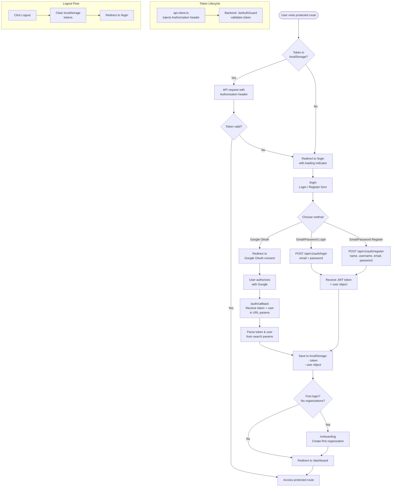

```mermaid
flowchart TD
    Start([User visits protected route]) --> CheckToken{Token in\nlocalStorage?}

    CheckToken -->|Yes| ValidateToken[API request with\nAuthorization header]
    ValidateToken --> TokenValid{Token valid?}
    TokenValid -->|Yes| AccessGranted[Access protected route]
    TokenValid -->|No| RedirectLogin

    CheckToken -->|No| RedirectLogin[Redirect to /login\nwith loading indicator]

    RedirectLogin --> LoginPage["/login\nLogin / Register form"]

    LoginPage --> AuthMethod{Choose method}

    AuthMethod -->|Email/Password Login| EmailLogin[POST /api/v1/auth/login\nemail + password]
    AuthMethod -->|Email/Password Register| EmailRegister[POST /api/v1/auth/register\nname, username, email, password]
    AuthMethod -->|Google OAuth| GoogleRedirect[Redirect to\nGoogle OAuth consent]

    EmailLogin --> ReceiveJWT[Receive JWT token\n+ user object]
    EmailRegister --> ReceiveJWT

    GoogleRedirect --> GoogleConsent[User authorizes\nwith Google]
    GoogleConsent --> GoogleCallback["/auth/callback\nReceive token + user\nin URL params"]
    GoogleCallback --> ParseCallback[Parse token & user\nfrom search params]
    ParseCallback --> SaveAuth

    ReceiveJWT --> SaveAuth[Save to localStorage:\n- token\n- user object]

    SaveAuth --> FirstTime{First login?\nNo organizations?}
    FirstTime -->|Yes| Onboarding["/onboarding\nCreate first organization"]
    FirstTime -->|No| RedirectDashboard[Redirect to /dashboard]
    Onboarding --> RedirectDashboard

    RedirectDashboard --> AccessGranted

    subgraph Token Lifecycle
        direction LR
        APIClient["api-client.ts\ninjects Authorization header"]
        JWTGuard["Backend: JwtAuthGuard\nvalidates token"]
        APIClient --> JWTGuard
    end

    subgraph Logout Flow
        LogoutBtn[Click Logout] --> ClearStorage[Clear localStorage\ntokens]
        ClearStorage --> RedirectToLogin[Redirect to /login]
    end
```