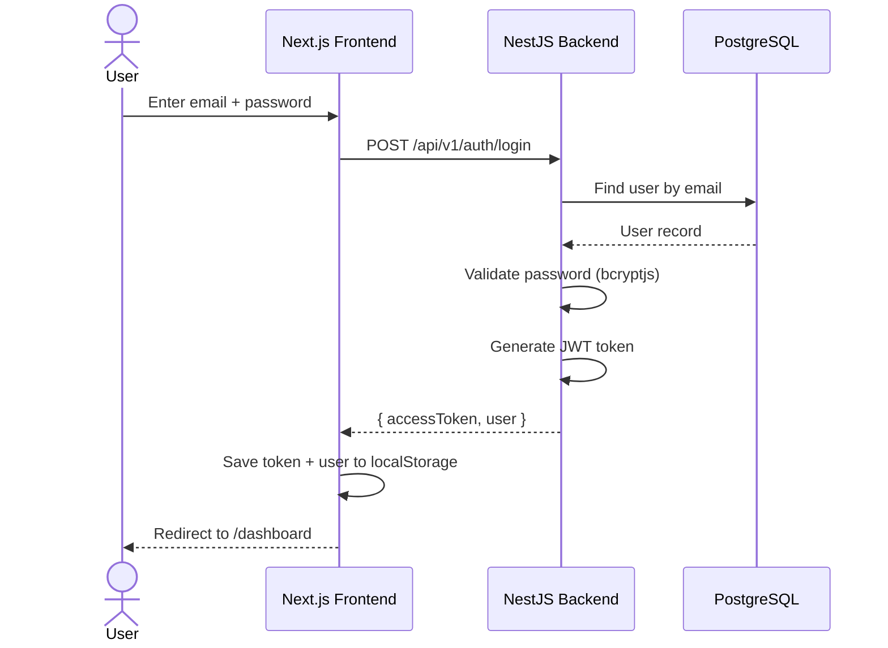
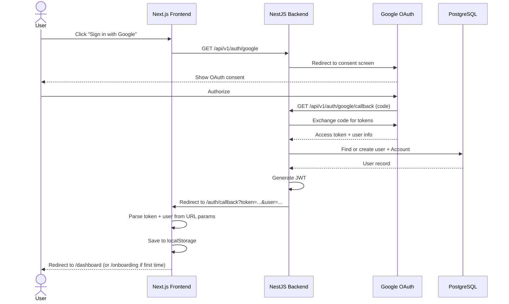
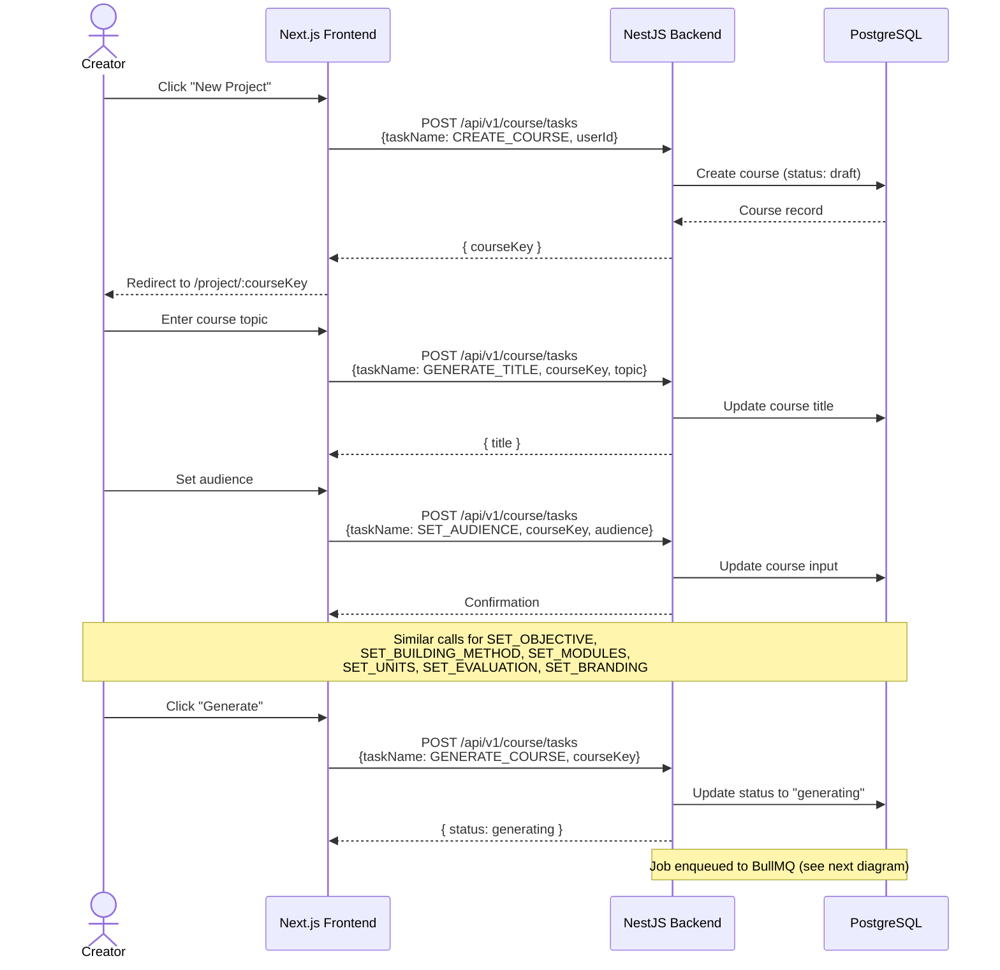
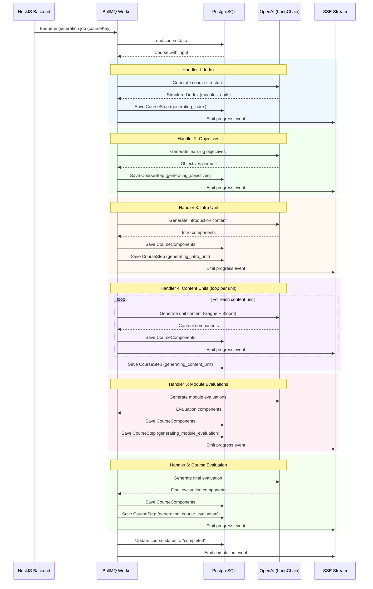
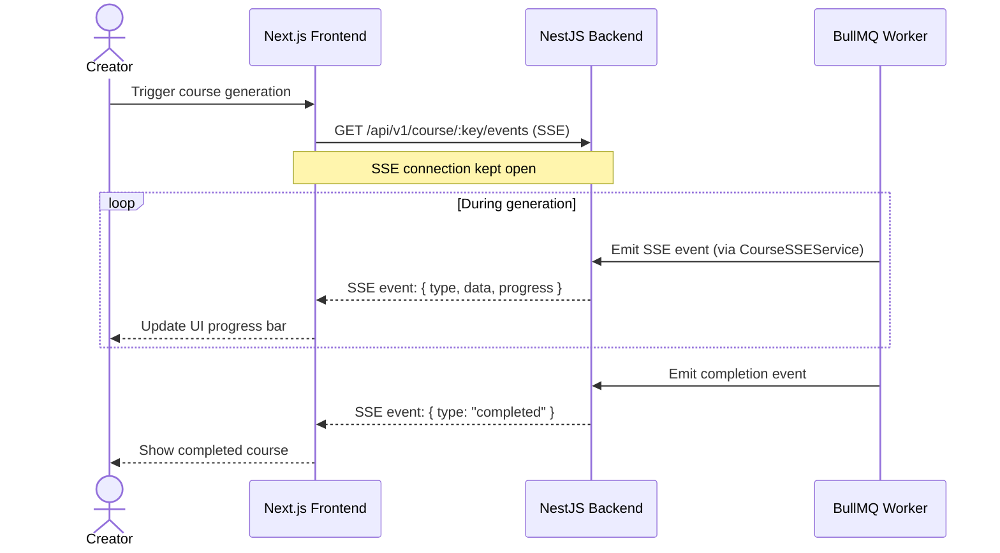
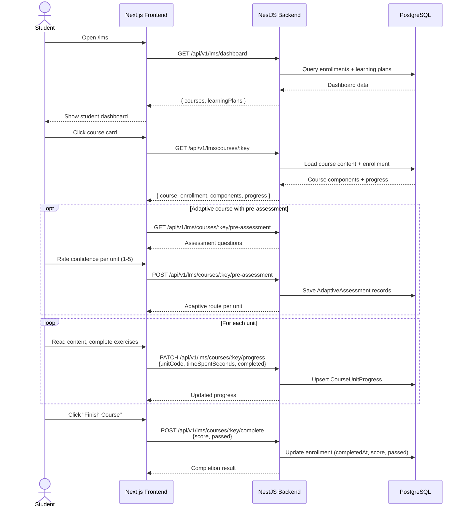
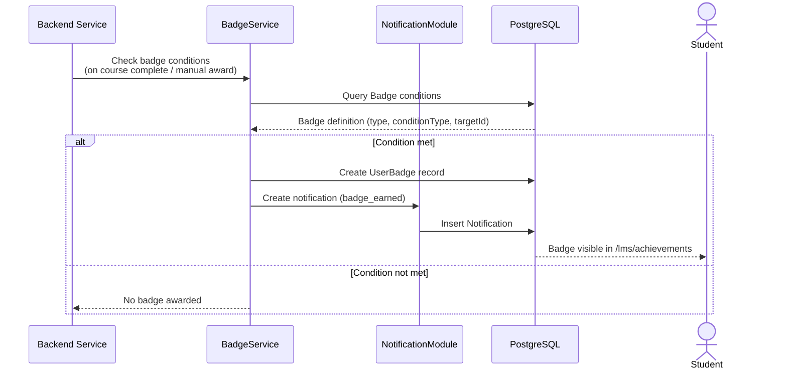
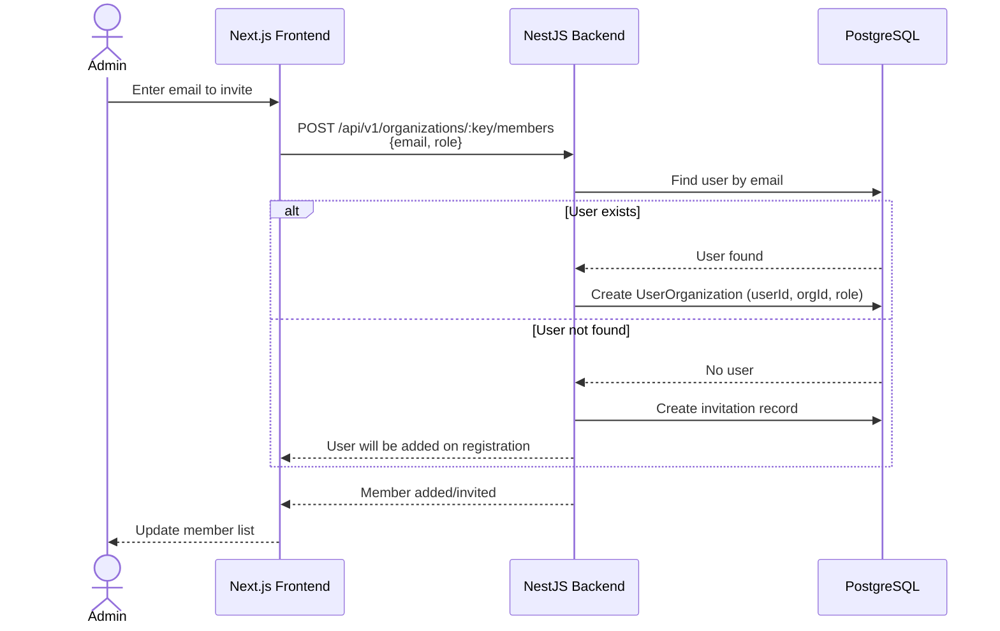

# Sequence Diagrams

> Key interaction sequences in **acadion.ai** showing how the frontend, backend, database, queue, and external services communicate.

---

## 1. Authentication -- Email Login

---

## 2. Authentication -- Google OAuth

---

## 3. Course Creation -- AI Chat Flow

---

## 4. Course Generation -- AI Pipeline (Background Job)

---

## 5. SSE -- Real-Time Progress Streaming

---

## 6. LMS -- Student Course Flow

---

## 7. Badge Award Flow

---

## 8. Organization Member Invitation

