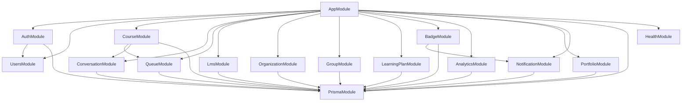
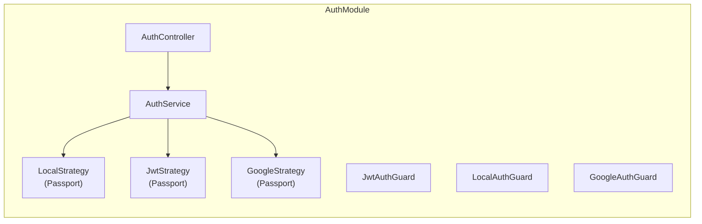
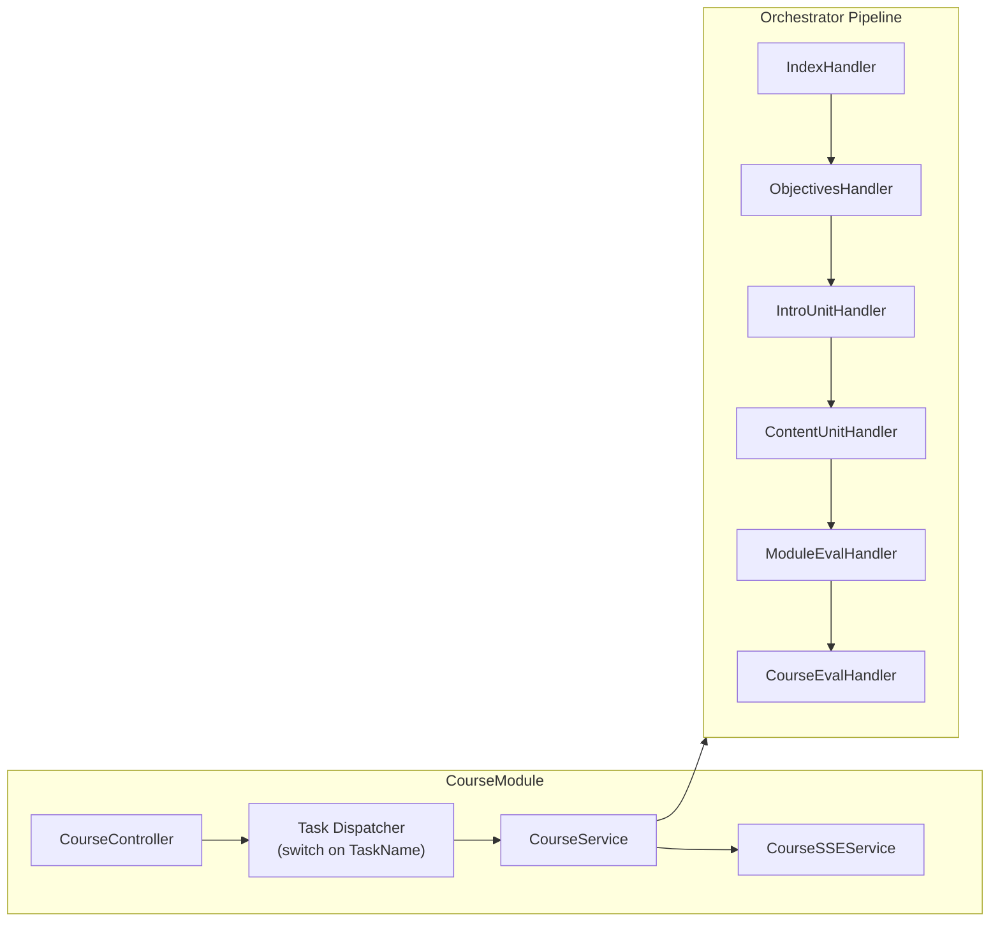
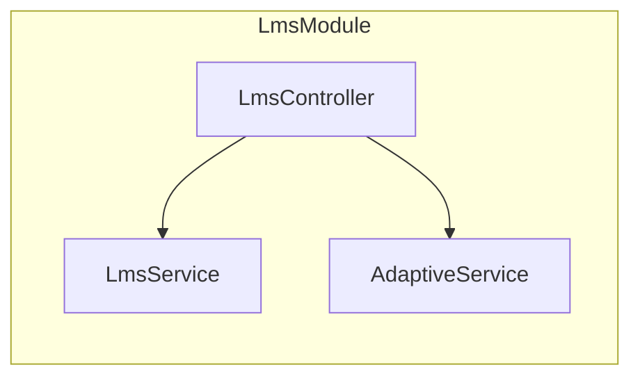
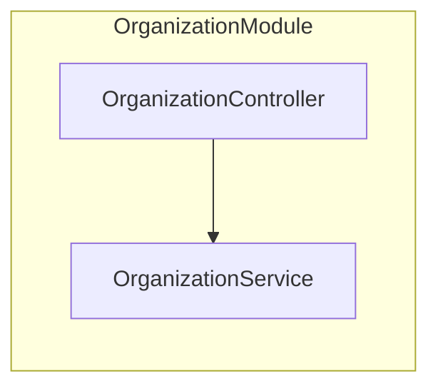
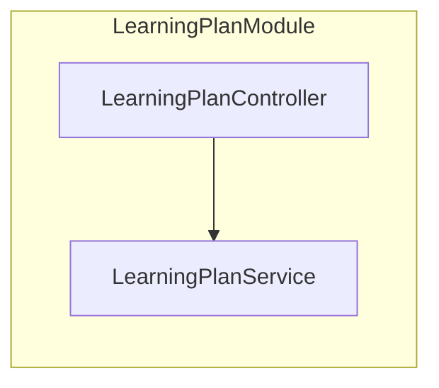
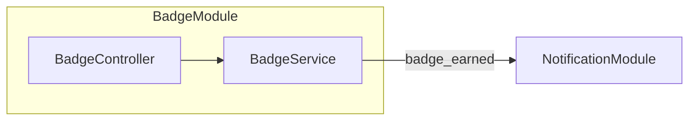
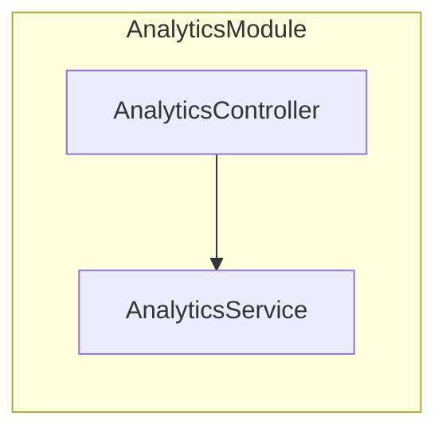
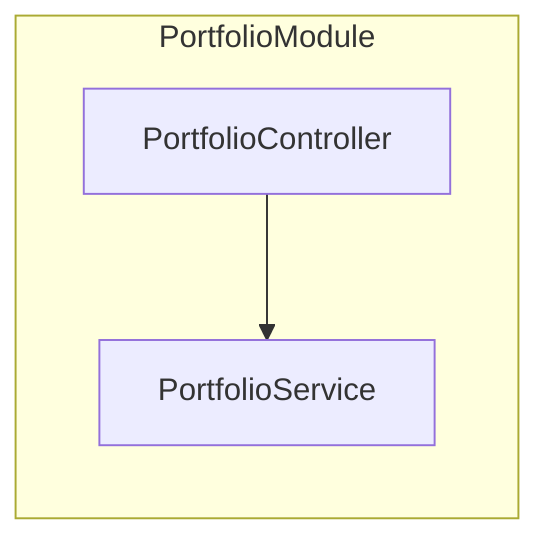
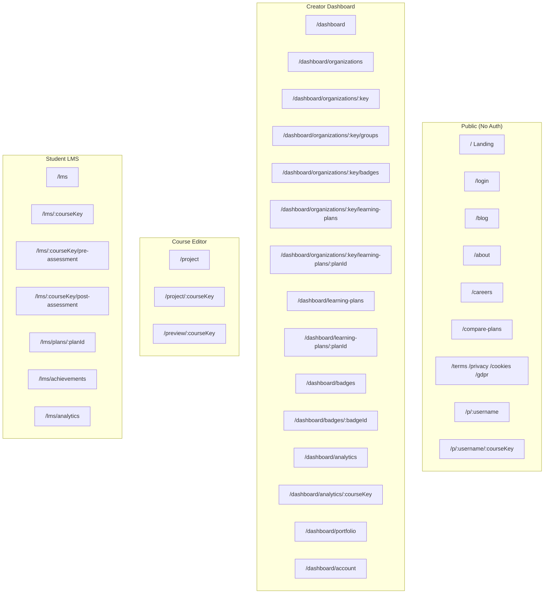

# Feature Modules

> Maps each feature module in **acadion.ai** to its backend module, frontend routes, database models, and API endpoints.

---

## Module Dependency Graph

---

## 1. AuthModule

Authentication and authorization.

| Aspect | Details |
|---|---|
| **Backend** | `src/auth/` |
| **Frontend Routes** | `/login`, `/auth/callback`, `/onboarding` |
| **DB Models** | `User`, `Account`, `Session`, `VerificationToken` |
| **API Endpoints** | `POST /auth/register`, `POST /auth/login`, `GET /auth/google`, `GET /auth/google/callback`, `GET /auth/profile`, `POST /auth/logout` |

---

## 2. CourseModule

Core course creation and AI-powered generation.

| Aspect | Details |
|---|---|
| **Backend** | `src/course/`, `src/course/orchestrator/`, `src/queue/` |
| **Frontend Routes** | `/dashboard` (list), `/project` (create), `/project/[courseKey]` (editor), `/preview/[courseKey]` |
| **DB Models** | `Course`, `CourseStep`, `Component`, `CourseComponent`, `Conversation`, `Message` |
| **API Endpoints** | `POST /course/tasks` (dispatcher), `GET /course` (list), `GET /course/:key`, `GET /course/:key/components`, `SSE /course/:key/events` |
| **Task Names** | `CREATE_COURSE`, `GENERATE_TITLE`, `SET_AUDIENCE`, `SET_OBJECTIVE`, `SET_BUILDING_METHOD`, `SET_MODULES`, `SET_UNITS`, `GET_EXERCISE_TYPES`, `SET_EVALUATION`, `SET_EVALUATION_DETAILS`, `SET_BRANDING`, `GENERATE_COURSE` |

---

## 3. LmsModule

Student-facing learning management system.

| Aspect | Details |
|---|---|
| **Backend** | `src/lms/` |
| **Frontend Routes** | `/lms` (dashboard), `/lms/[courseKey]` (player), `/lms/[courseKey]/pre-assessment`, `/lms/[courseKey]/post-assessment`, `/lms/plans/[planId]`, `/lms/achievements`, `/lms/analytics` |
| **DB Models** | `Enrollment`, `CourseUnitProgress`, `KnowledgeCheckAttempt`, `AdaptiveAssessment` |
| **API Endpoints** | `GET /lms/dashboard`, `GET /lms/courses/:key`, `POST /lms/courses/:key/enroll`, `PATCH /lms/courses/:key/progress`, `POST /lms/courses/:key/complete`, `POST /lms/courses/:key/knowledge-check`, `POST /lms/courses/:key/admin-enroll`, `POST /lms/courses/:key/re-enroll/:userId`, `GET /lms/courses/:key/pre-assessment`, `POST /lms/courses/:key/pre-assessment`, `GET /lms/courses/:key/post-assessment`, `POST /lms/courses/:key/post-assessment` |

---

## 4. OrganizationModule

Multi-tenant organization management.

| Aspect | Details |
|---|---|
| **Backend** | `src/organization/` |
| **Frontend Routes** | `/dashboard/organizations`, `/dashboard/organizations/[key]`, `/dashboard/organizations/[key]/groups`, `/dashboard/organizations/[key]/badges`, `/dashboard/organizations/[key]/learning-plans`, `/dashboard/organizations/[key]/learning-plans/[planId]` |
| **DB Models** | `Organization`, `UserOrganization` |
| **API Endpoints** | `POST /organizations`, `GET /organizations`, `GET /organizations/:key`, `POST /organizations/:key/members`, `PATCH /organizations/:key/members/:userId/role`, `DELETE /organizations/:key/members/:userId` |

---

## 5. GroupModule

Student groups within organizations.

| Aspect | Details |
|---|---|
| **Backend** | `src/group/` |
| **Frontend Routes** | `/dashboard/organizations/[key]/groups` |
| **DB Models** | `Group`, `UserGroup` |

---

## 6. LearningPlanModule

Structured learning paths with ordered courses.

| Aspect | Details |
|---|---|
| **Backend** | `src/learning-plan/` |
| **Frontend Routes** | `/dashboard/learning-plans`, `/dashboard/learning-plans/[planId]`, `/dashboard/organizations/[key]/learning-plans`, `/dashboard/organizations/[key]/learning-plans/[planId]`, `/lms/plans/[planId]` |
| **DB Models** | `LearningPlan`, `LearningPlanCourse`, `UserLearningPlan` |

---

## 7. BadgeModule

Gamification badges and achievements.

| Aspect | Details |
|---|---|
| **Backend** | `src/badge/` |
| **Frontend Routes** | `/dashboard/badges`, `/dashboard/badges/[badgeId]`, `/dashboard/organizations/[key]/badges`, `/lms/achievements` |
| **DB Models** | `Badge`, `UserBadge` |
| **API Endpoints** | `GET /badges/me`, `GET /badges/my`, `GET /badges/org/:orgKey`, `GET /badges/:id`, `POST /badges/org/:orgKey`, `PATCH /badges/:id`, `DELETE /badges/:id`, `POST /badges/:id/duplicate`, `POST /badges/:id/award` |
| **Badge Types** | `progress`, `level`, `excellence`, `role` |

---

## 8. AnalyticsModule

Metrics and analytics for courses, organizations, and students.

| Aspect | Details |
|---|---|
| **Backend** | `src/analytics/` |
| **Frontend Routes** | `/dashboard/analytics`, `/dashboard/analytics/[courseKey]`, `/lms/analytics` |
| **API Endpoints** | `GET /analytics/course/:key`, `GET /analytics/course/:key/users`, `GET /analytics/org/:orgKey`, `GET /analytics/me` |

---

## 9. PortfolioModule

Public-facing user portfolio.

| Aspect | Details |
|---|---|
| **Backend** | `src/portfolio/` |
| **Frontend Routes** | `/dashboard/portfolio` (settings), `/p/[username]` (public), `/p/[username]/[courseKey]` (public course view) |
| **DB Models** | `Portfolio`, `PortfolioImage`, `PortfolioVideo`, `PortfolioVisit`, `PortfolioContactMessage`, `PortfolioCourse` |

---

## 10. NotificationModule

In-app notification system.

| Aspect | Details |
|---|---|
| **Backend** | `src/notification/` |
| **Frontend** | `NotificationBell` component in dashboard navbar |
| **DB Models** | `Notification` |
| **Notification Types** | `enrolled`, `learning_plan_assigned`, `course_completed`, `course_failed`, `badge_earned`, `invitation` |

---

## 11. ConversationModule

AI chat conversations during course creation.

| Aspect | Details |
|---|---|
| **Backend** | `src/conversation/` |
| **DB Models** | `Conversation`, `Message` |
| **Message Roles** | `user`, `assistant`, `system` |

---

## Frontend Route Map

